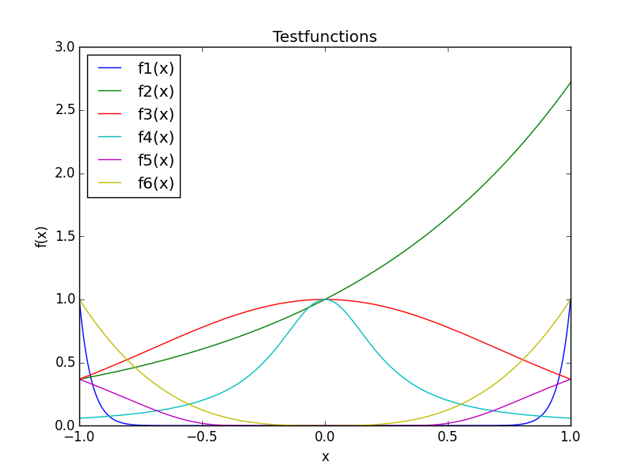
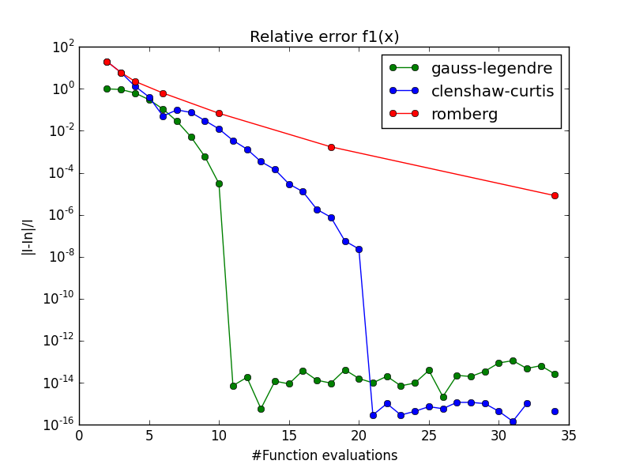
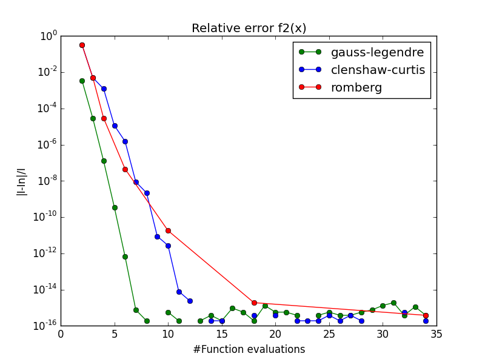
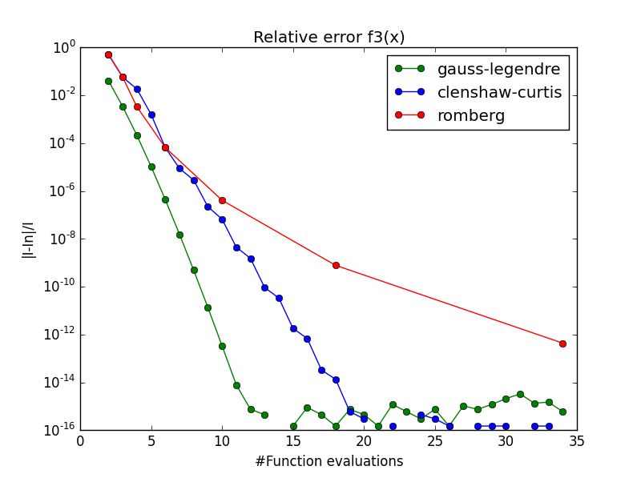
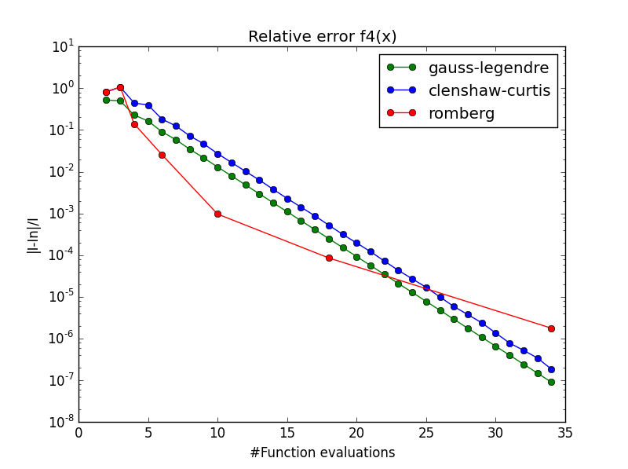
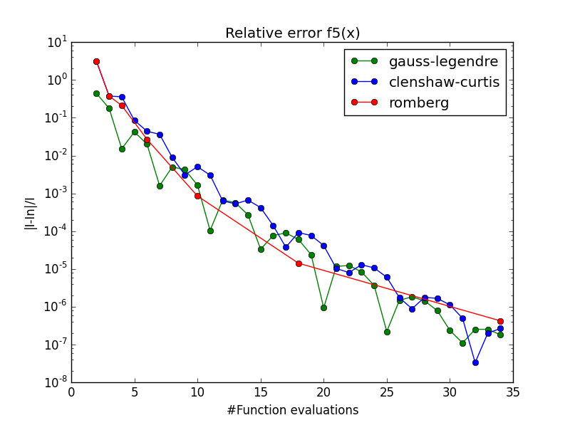
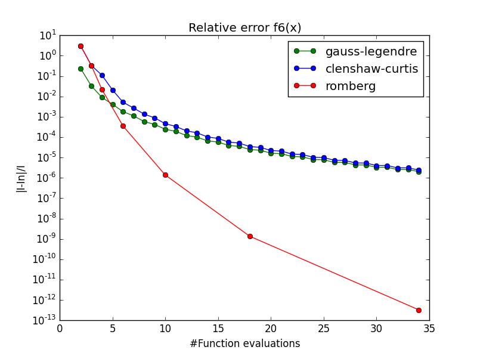

[![License][s1]][li]

[s1]: https://img.shields.io/badge/licence-GPL%203.0-blue.svg
[li]: https://raw.githubusercontent.com/matt77hias/QuadratureExperiments/master/LICENSE.txt

# QuadratureExperiments
Course Deterministic and Stochastic Integration Techniques: Quadrature experiments

**Academic Year**: 2014-2015 (2nd semester - 2nd Master of Science in Engineering: Computer Science)

## About
Numerical integration using quadrature formulas (e.g., Gauss-Legendre, Clenshaw-Curtis, Romberg table).

 

 

 

